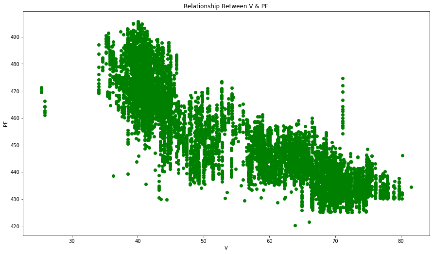

### IMPORT LIBRARIES


```python
import pandas as pd
import numpy as np
import matplotlib.pyplot as plt
%matplotlib inline
from sklearn.model_selection import train_test_split
from sklearn.linear_model import LinearRegression
from sklearn import metrics
from sklearn.metrics import r2_score
```

### GETTING KNOW ABOUT DATASET


```python
df = pd.read_excel('E:\My Works\My Career\Projects\Data Analysis & Machine Learning\Machine Learning\Multiple Linear Regresssion\CCPP\CCPP\Folds5x2_pp.xlsx')
```


```python
df.head()
```


<div>
<style scoped>
    .dataframe tbody tr th:only-of-type {
        vertical-align: middle;
    }

    .dataframe tbody tr th {
        vertical-align: top;
    }

    .dataframe thead th {
        text-align: right;
    }
</style>
<table border="1" class="dataframe">
  <thead>
    <tr style="text-align: right;">
      <th></th>
      <th>AT</th>
      <th>V</th>
      <th>AP</th>
      <th>RH</th>
      <th>PE</th>
    </tr>
  </thead>
  <tbody>
    <tr>
      <th>0</th>
      <td>14.96</td>
      <td>41.76</td>
      <td>1024.07</td>
      <td>73.17</td>
      <td>463.26</td>
    </tr>
    <tr>
      <th>1</th>
      <td>25.18</td>
      <td>62.96</td>
      <td>1020.04</td>
      <td>59.08</td>
      <td>444.37</td>
    </tr>
    <tr>
      <th>2</th>
      <td>5.11</td>
      <td>39.40</td>
      <td>1012.16</td>
      <td>92.14</td>
      <td>488.56</td>
    </tr>
    <tr>
      <th>3</th>
      <td>20.86</td>
      <td>57.32</td>
      <td>1010.24</td>
      <td>76.64</td>
      <td>446.48</td>
    </tr>
    <tr>
      <th>4</th>
      <td>10.82</td>
      <td>37.50</td>
      <td>1009.23</td>
      <td>96.62</td>
      <td>473.90</td>
    </tr>
  </tbody>
</table>
</div>


### COLUMNS NAMES

Features consist of hourly average ambient variables
- Temperature (T) in the range 1.81°C and 37.11°C,
- Ambient Pressure (AP) in the range 992.89-1033.30 milibar,
- Relative Humidity (RH) in the range 25.56% to 100.16%
- Exhaust Vacuum (V) in teh range 25.36-81.56 cm Hg
- Net hourly electrical energy output (EP) 420.26-495.76 MW
The averages are taken from various sensors located around the plant that record the ambient variables every second. The variables are given without normalization


```python
df.shape
```


    (9568, 5)


```python
df.info()
```

    <class 'pandas.core.frame.DataFrame'>
    RangeIndex: 9568 entries, 0 to 9567
    Data columns (total 5 columns):
     #   Column  Non-Null Count  Dtype  
    ---  ------  --------------  -----  
     0   AT      9568 non-null   float64
     1   V       9568 non-null   float64
     2   AP      9568 non-null   float64
     3   RH      9568 non-null   float64
     4   PE      9568 non-null   float64
    dtypes: float64(5)
    memory usage: 373.9 KB
    


```python
df.isnull().sum()
```


    AT    0
    V     0
    AP    0
    RH    0
    PE    0
    dtype: int64


```python
df.describe()
```


<div>
<style scoped>
    .dataframe tbody tr th:only-of-type {
        vertical-align: middle;
    }

    .dataframe tbody tr th {
        vertical-align: top;
    }

    .dataframe thead th {
        text-align: right;
    }
</style>
<table border="1" class="dataframe">
  <thead>
    <tr style="text-align: right;">
      <th></th>
      <th>AT</th>
      <th>V</th>
      <th>AP</th>
      <th>RH</th>
      <th>PE</th>
    </tr>
  </thead>
  <tbody>
    <tr>
      <th>count</th>
      <td>9568.000000</td>
      <td>9568.000000</td>
      <td>9568.000000</td>
      <td>9568.000000</td>
      <td>9568.000000</td>
    </tr>
    <tr>
      <th>mean</th>
      <td>19.651231</td>
      <td>54.305804</td>
      <td>1013.259078</td>
      <td>73.308978</td>
      <td>454.365009</td>
    </tr>
    <tr>
      <th>std</th>
      <td>7.452473</td>
      <td>12.707893</td>
      <td>5.938784</td>
      <td>14.600269</td>
      <td>17.066995</td>
    </tr>
    <tr>
      <th>min</th>
      <td>1.810000</td>
      <td>25.360000</td>
      <td>992.890000</td>
      <td>25.560000</td>
      <td>420.260000</td>
    </tr>
    <tr>
      <th>25%</th>
      <td>13.510000</td>
      <td>41.740000</td>
      <td>1009.100000</td>
      <td>63.327500</td>
      <td>439.750000</td>
    </tr>
    <tr>
      <th>50%</th>
      <td>20.345000</td>
      <td>52.080000</td>
      <td>1012.940000</td>
      <td>74.975000</td>
      <td>451.550000</td>
    </tr>
    <tr>
      <th>75%</th>
      <td>25.720000</td>
      <td>66.540000</td>
      <td>1017.260000</td>
      <td>84.830000</td>
      <td>468.430000</td>
    </tr>
    <tr>
      <th>max</th>
      <td>37.110000</td>
      <td>81.560000</td>
      <td>1033.300000</td>
      <td>100.160000</td>
      <td>495.760000</td>
    </tr>
  </tbody>
</table>
</div>


### DATA ANALYSIS


```python
plt.figure(figsize=(15,8.5))

plt.scatter(df.AT,df.PE,color = 'red')
plt.title('Relationship Between AT & PE')

plt.xlabel('AT')
plt.ylabel('PE')
plt.show()
```


    

    


```python
plt.figure(figsize=(15,8.5))

plt.scatter(df.V,df.PE,color = 'green')
plt.title('Relationship Between V & PE')

plt.xlabel('V')
plt.ylabel('PE')
plt.show()
```


    

    


```python
plt.figure(figsize=(15,8.5))

plt.scatter(df.AP,df.PE,color = 'blue')
plt.title('Relationship Between AP & PE')

plt.xlabel('AP')
plt.ylabel('PE')
plt.show()
```


    

    


```python
plt.figure(figsize=(15,8.5))

plt.scatter(df.RH,df.PE,color = 'gray')
plt.title('Relationship Between RH & PE')

plt.xlabel('RH')
plt.ylabel('PE')
plt.show()
```


    

    


### DATA PRE PROCESSING


```python
x = df.drop(['PE'],axis = 1).values
y = df['PE'].values
```


```python
print(x)
```

    [[  14.96   41.76 1024.07   73.17]
     [  25.18   62.96 1020.04   59.08]
     [   5.11   39.4  1012.16   92.14]
     ...
     [  31.32   74.33 1012.92   36.48]
     [  24.48   69.45 1013.86   62.39]
     [  21.6    62.52 1017.23   67.87]]
    


```python
x.shape
```


    (9568, 4)


```python
print(y)
```

    [463.26 444.37 488.56 ... 429.57 435.74 453.28]
    


```python
y.shape
```


    (9568,)


```python
x_train,x_test,y_train,y_test = train_test_split(x,y,test_size=2/5,random_state=0)
```

#### DATA NORMALIZATION


```python
from sklearn import preprocessing
```


```python
df_sc_val = df.values #returns a numpy array
min_max_scaler = preprocessing.MinMaxScaler()
scaled = min_max_scaler.fit_transform(df_sc_val)
df_scaled = pd.DataFrame(scaled)
```


```python
df_scaled.head()
```


<div>
<style scoped>
    .dataframe tbody tr th:only-of-type {
        vertical-align: middle;
    }

    .dataframe tbody tr th {
        vertical-align: top;
    }

    .dataframe thead th {
        text-align: right;
    }
</style>
<table border="1" class="dataframe">
  <thead>
    <tr style="text-align: right;">
      <th></th>
      <th>0</th>
      <th>1</th>
      <th>2</th>
      <th>3</th>
      <th>4</th>
    </tr>
  </thead>
  <tbody>
    <tr>
      <th>0</th>
      <td>0.372521</td>
      <td>0.291815</td>
      <td>0.771591</td>
      <td>0.638204</td>
      <td>0.569536</td>
    </tr>
    <tr>
      <th>1</th>
      <td>0.662040</td>
      <td>0.669039</td>
      <td>0.671863</td>
      <td>0.449330</td>
      <td>0.319338</td>
    </tr>
    <tr>
      <th>2</th>
      <td>0.093484</td>
      <td>0.249822</td>
      <td>0.476862</td>
      <td>0.892493</td>
      <td>0.904636</td>
    </tr>
    <tr>
      <th>3</th>
      <td>0.539660</td>
      <td>0.568683</td>
      <td>0.429349</td>
      <td>0.684718</td>
      <td>0.347285</td>
    </tr>
    <tr>
      <th>4</th>
      <td>0.255241</td>
      <td>0.216014</td>
      <td>0.404355</td>
      <td>0.952547</td>
      <td>0.710464</td>
    </tr>
  </tbody>
</table>
</div>


```python
x_scaled = df.drop(['PE'],axis = 1).values
y_scaled = df['PE'].values
```


```python
x_scaled_train,x_scaled_test,y_scaled_train,y_scaled_test = train_test_split(x,y,test_size=2/5,random_state=0)
```

### MODEL BUILDING


```python
model = LinearRegression()
model.fit(x_scaled_train,y_scaled_train)
```


    LinearRegression()


```python
print(model.coef_)
```

    [-1.94472509 -0.24760347  0.07506161 -0.15503564]
    


```python
print(model.intercept_)
```

    441.3457275572486
    


```python
y_scaled_pred = model.predict(x_scaled_test)
```


```python
df_scaled_predict = pd.DataFrame({'Actual': y_scaled_test, 'Predicted': y_scaled_pred})
```

#### PREDTED VALUES VS ACTUAL VALUES


```python
df_scaled_predict.head(10)
```


<div>
<style scoped>
    .dataframe tbody tr th:only-of-type {
        vertical-align: middle;
    }

    .dataframe tbody tr th {
        vertical-align: top;
    }

    .dataframe thead th {
        text-align: right;
    }
</style>
<table border="1" class="dataframe">
  <thead>
    <tr style="text-align: right;">
      <th></th>
      <th>Actual</th>
      <th>Predicted</th>
    </tr>
  </thead>
  <tbody>
    <tr>
      <th>0</th>
      <td>431.23</td>
      <td>431.380099</td>
    </tr>
    <tr>
      <th>1</th>
      <td>460.01</td>
      <td>458.693816</td>
    </tr>
    <tr>
      <th>2</th>
      <td>461.14</td>
      <td>462.898805</td>
    </tr>
    <tr>
      <th>3</th>
      <td>445.90</td>
      <td>448.629814</td>
    </tr>
    <tr>
      <th>4</th>
      <td>451.29</td>
      <td>457.899927</td>
    </tr>
    <tr>
      <th>5</th>
      <td>432.68</td>
      <td>429.699591</td>
    </tr>
    <tr>
      <th>6</th>
      <td>477.50</td>
      <td>472.962966</td>
    </tr>
    <tr>
      <th>7</th>
      <td>459.68</td>
      <td>456.579206</td>
    </tr>
    <tr>
      <th>8</th>
      <td>477.50</td>
      <td>474.334219</td>
    </tr>
    <tr>
      <th>9</th>
      <td>444.99</td>
      <td>446.431027</td>
    </tr>
  </tbody>
</table>
</div>


### MODEL EVALUATE


```python
print('Mean Absolute Error:', metrics.mean_absolute_error(y_scaled_test, y_scaled_pred))
print('Mean Squared Error:', metrics.mean_squared_error(y_scaled_test, y_scaled_pred))
print('Root Mean Squared Error:', np.sqrt(metrics.mean_squared_error(y_scaled_test, y_scaled_pred)))
```

    Mean Absolute Error: 3.595033514909498
    Mean Squared Error: 20.154407301667643
    Root Mean Squared Error: 4.489366024470231
    


```python
r2_score(y_scaled_test,y_scaled_pred)
```


    0.9319844420474521


```python
plt.figure(figsize=(15,8.5))

plt.scatter(y_scaled_test,y_scaled_pred, color='red')
plt.title('Relationship Between Test Values & Prectied Values')

plt.xlabel('Actual values')
plt.ylabel('Predicted Values')
plt.show()
```


    

    


### CONCLUSION
>As Above Calculations RMSE ( Root Mean Squared Error ) Value is Higher Than 10% Of The Mean Petrol_Consumption. This means that our Model not did a much good job. but values are near so we can still consider as good model but not better

>And also r2 score is 0.93198 ( 93% ) its near to 100 so its mean this model did a good job

>And The Visualization display predicted values and Actual Values are have a strong bond. its mean our model is success.
